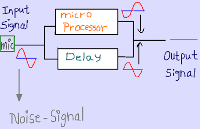
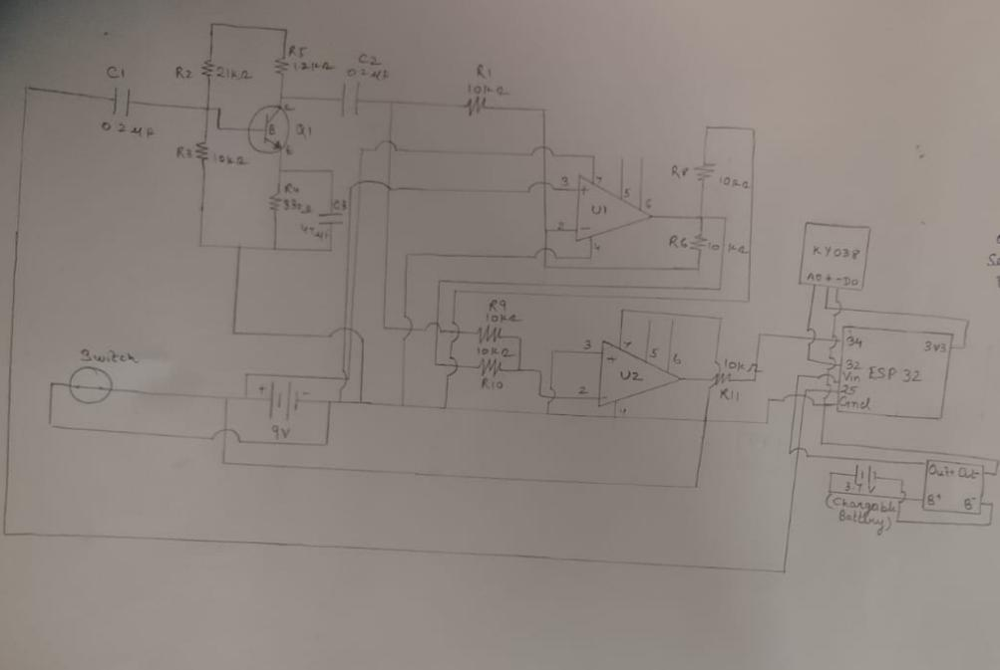
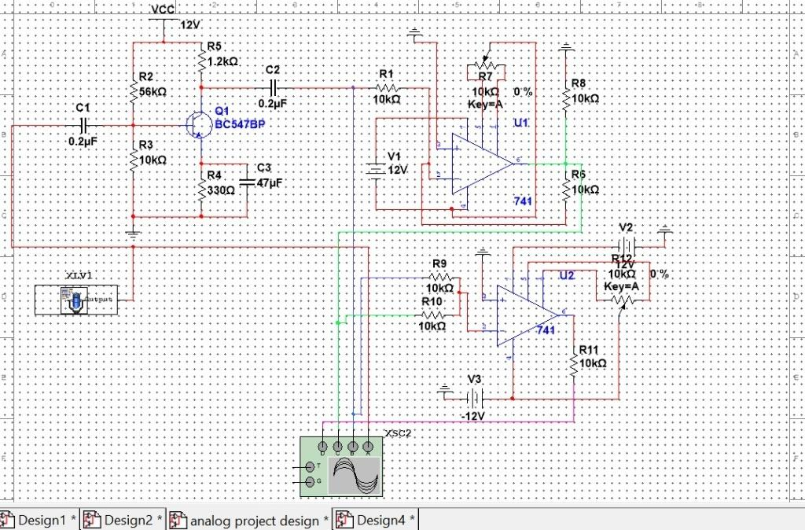
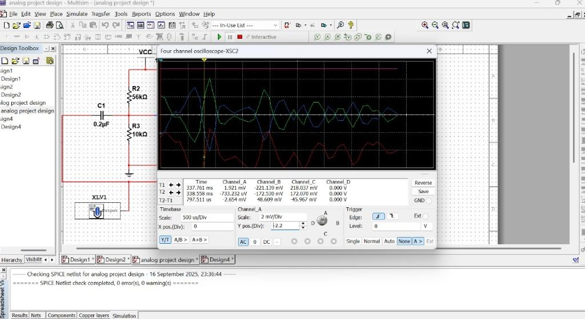
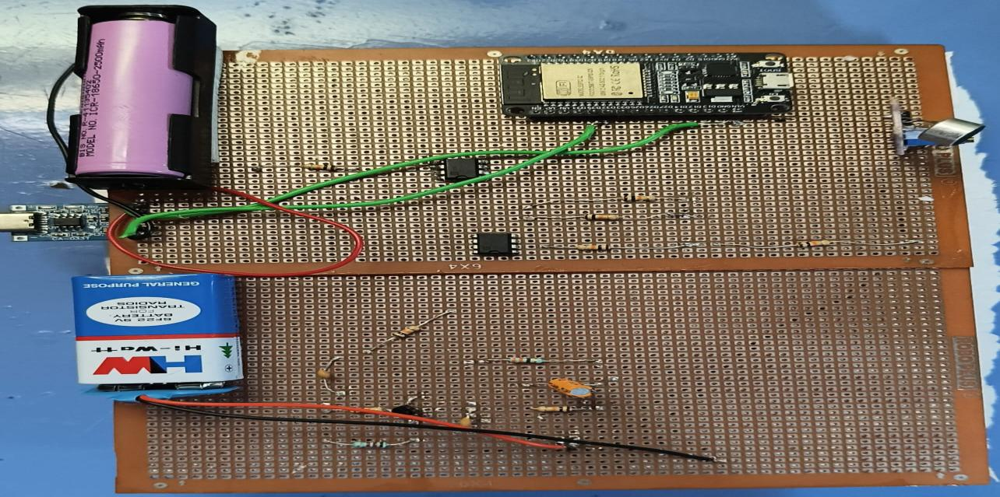
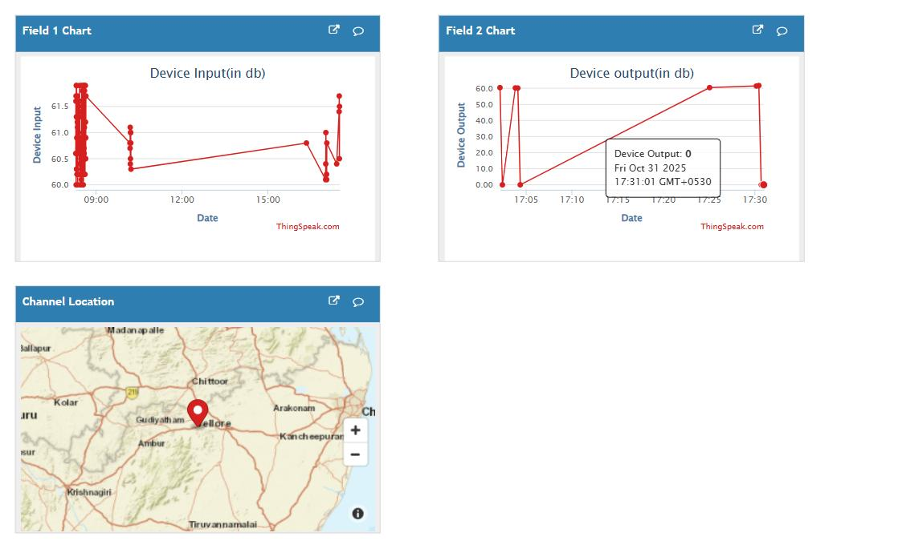

<div align="center">

# 🔊 ESP32 Secure IoT Noise Monitor

### AES‑128 Encrypted • Wi‑Fi Connected • ThingSpeak Powered • Geo‑Located

[](#)
[](#)
[](#)
[](#)
[](#)
[](#)
[](#-license)

*An ESP32-based IoT noise monitor that captures ambient sound through a KY-038 sensor and analog op-amp front end, then encrypts the readings with AES-128-CBC before streaming them to a ThingSpeak cloud dashboard over Wi-Fi. It combines analog circuit design (simulated in Multisim), embedded ESP-IDF firmware, and secure cloud telemetry with automatic geolocation tagging.*

</div>

---

## 📖 Table of Contents

- [Overview](#-overview)
- [Demo Video](#-demo-video)
- [Concept](#-concept)
- [Circuit Design](#-circuit-design)
- [Circuit Simulation (Multisim)](#-circuit-simulation-multisim)
- [Hardware Build](#-hardware-build)
- [Live Dashboard](#-live-dashboard)
- [Features](#-features)
- [Pin Mapping](#-pin-mapping)
- [Getting Started](#-getting-started)
- [Configuration](#-configuration)
- [Security Notes](#-security-notes)
- [Project Structure](#-project-structure)
- [Migration Notes: Arduino → ESP‑IDF](#-migration-notes-arduino--esp-idf)
- [Roadmap](#-roadmap)
- [License](#-license)

---

## 🧭 Overview

This project turns an **ESP32** into a self‑contained, secure environmental noise monitor. A **KY‑038 sound sensor**, conditioned by a two‑stage op‑amp analog front end, feeds the ESP32's ADC. Every reading is packaged, encrypted with **AES‑128‑CBC**, Base64‑encoded, and pushed to a **ThingSpeak** channel over HTTPS every 15 seconds. On first boot the firmware also performs a **one‑time IP‑geolocation lookup** to tag the channel with the device's approximate location.

> Originally written as an Arduino `.ino` sketch, the firmware has been fully ported to native **ESP‑IDF** APIs (FreeRTOS tasks, `esp_wifi`, `esp_http_client`, `mbedtls`, `cJSON`, `adc_oneshot`/`dac_oneshot`) for better performance, smaller footprint, and production‑grade reliability.

---

## 🎥 Demo Video

<div align="center">

[](https://drive.google.com/file/d/15_0bdoHpWjXioNacGf8ohi-IqMifmU-_/view?usp=drivesdk)

*Click the badge above to watch the full working demo (hosted on Google Drive).*

## 💡 Concept

<div align="center">

</div>

The core idea: a **microphone** captures the ambient input signal, a **microprocessor** stage analyzes it while a **delay** stage runs in parallel, and the two are combined to separate the genuine noise signal from the output — filtering transient/background noise out of the final reading.

---

## 🔌 Circuit Design

The analog front end conditions the KY‑038 output through a **BC547 transistor pre‑amp stage** and **dual op‑amp (741) comparator/gain stages**, before handing a clean signal to the ESP32's ADC.

<div align="center">


<sub>Clean schematic — transistor pre‑amp, dual op‑amp stage, KY‑038 sensor, and ESP32 interface</sub>
</div>

<details>
<summary><b>📝 Original hand‑drawn schematic (click to expand)</b></summary>
<br>
<div align="center">

</div>
</details>

| Signal | ESP32 Pin | Peripheral | Purpose |
|:--|:--:|:--|:--|
| 🎤 KY‑038 Analog Out | `GPIO32` (ADC1_CH4) | Sound sensor module | Conditioned noise‑level reading |
| 📈 KY‑038 Digital Out | `GPIO34` | Sound sensor module | Threshold / trigger signal |
| 🔋 Power | `Vin` / `Gnd` | 3.7 V rechargeable + 9 V supply | System power |
| 📶 Wi‑Fi | *(internal)* | 2.4 GHz station mode | Connects to your local network |

---

## 🧪 Circuit Simulation (Multisim)

The analog stage was validated in **NI Multisim** before breadboarding — a BC547 transistor pre‑amp feeding two LM741 op‑amp stages (±12 V rails), probed on a virtual four‑channel oscilloscope.

<div align="center">

<sub>Multisim schematic — transistor pre‑amp + dual 741 op‑amp stages</sub>
<br><br>

<sub>Four‑channel oscilloscope trace showing the signal settling through each amplification stage</sub>
</div>

---

## 🛠️ Hardware Build

Prototyped on general‑purpose perfboard, powered by a rechargeable 18650 cell (via a protection/charge module) with a 9 V backup supply for the analog stage.

<div align="center">


<sub>Top view — ESP32, sensor module, discrete analog components, 18650 cell + charge module</sub>

<br><br>


<sub>Underside wiring — point‑to‑point hand soldering with power switch</sub>

</div>

---

## ☁️ Live Dashboard

Data lands on **ThingSpeak**, which plots the raw device input alongside the processed output level in real time, plus a map pin from the one‑time geolocation update.

<div align="center">

<sub>Field 1 — Device input (dB) · Field 2 — Device output (dB) · Channel location map</sub>
</div>

---

## ✨ Features

| | |
|---|---|
| 🔐 **On‑device encryption** | AES‑128‑CBC via `mbedtls`, Base64‑encoded before transmission |
| 📡 **Resilient Wi‑Fi** | FreeRTOS event‑group based connect/reconnect logic |
| ☁️ **ThingSpeak integration** | Periodic field updates + one‑time channel geolocation |
| 🎚️ **Analog front end** | BC547 pre‑amp + dual‑op‑amp conditioning ahead of the ADC |
| 🔊 **Live monitor output** | 8‑bit DAC pass‑through for a buzzer / line‑out |
| ⚙️ **Modern ESP‑IDF APIs** | `adc_oneshot`, `dac_oneshot`, `esp_http_client`, `cJSON` — no Arduino core required |

---

## 📌 Pin Mapping

```text
                       ┌────────────────────────┐
   KY-038 (AO)  ─────▶│ GPIO32  (ADC1_CH4)      │
   KY-038 (DO)  ─────▶│ GPIO34  (ADC1_CH6)      │   ESP32
   Buzzer/LineOut ◀───│ GPIO25  (DAC_CH0)        │
                       │            Wi‑Fi (int.) │──▶ Router / Internet
                       └────────────────────────┘
```

---

## 🚀 Getting Started

### 1. Prerequisites
- [ESP‑IDF](https://docs.espressif.com/projects/esp-idf/en/latest/esp32/get-started/) v5.x installed and exported (`. $IDF_PATH/export.sh`)
- A ThingSpeak account + channel with **Write API Key**

### 2. Clone & Configure

```bash
git clone <your-repo-url>
cd noise_monitor_idf
idf.py set-target esp32
```

### 3. Set Your Credentials

Edit the constants near the top of `main.cpp`:

```cpp
static const char *WIFI_SSID      = "YOUR_WIFI_SSID";
static const char *WIFI_PASSWORD  = "YOUR_WIFI_PASSWORD";
static const char *CHANNEL_ID     = "YOUR_CHANNEL_ID";
static const char *WRITE_API_KEY  = "YOUR_WRITE_API_KEY";
```

### 4. Build, Flash & Monitor

```bash
idf.py build
idf.py -p /dev/ttyUSB0 flash monitor
```

---

## ⚙️ Configuration

| Constant | Location | Description |
|---|---|---|
| `WIFI_SSID` / `WIFI_PASSWORD` | `main.cpp` | Wi‑Fi station credentials |
| `CHANNEL_ID` / `WRITE_API_KEY` | `main.cpp` | ThingSpeak channel + write key |
| `aesKey[16]` / `aesIv[16]` | `main.cpp` | AES‑128 key & IV — **replace before deployment** |
| `SOUND_SENSOR_CHANNEL` / `ANALOG_INPUT_CHANNEL` | `main.cpp` | ADC channel mapping |
| `DAC_OUTPUT_CHANNEL` | `main.cpp` | DAC channel mapping |

---

## 🛡️ Security Notes

> ⚠️ The AES key/IV in `main.cpp` are **placeholders** compiled into the binary — this is for demonstration only.

For production deployments, consider:
- Storing secrets in **NVS** rather than hard‑coding them
- Enabling **Flash Encryption** and **Secure Boot**
- Rotating the AES key/IV per‑device rather than sharing one globally
- Using TLS certificate pinning for the ThingSpeak/`ip-api.com` endpoints

---

## 🗂️ Project Structure

```text
.
├── CMakeLists.txt          # ESP-IDF component registration
├── main.cpp                # Firmware: Wi-Fi, ADC/DAC, AES, HTTP, main task
└── docs/
    └── images/
        ├── conceptual_block_diagram.png
        ├── circuit_diagram.jpeg
        ├── hand_drawn_circuit_diagram.jpg
        ├── multisim_simulation_circuit.jpg
        ├── multisim_oscilloscope_output.jpg
        ├── pcb_topview.jpg
        ├── pcb_backside.jpg
        └── web_dashboard.jpg
```

---

## 🔄 Migration Notes: Arduino → ESP‑IDF

| Arduino API | ESP‑IDF Equivalent |
|---|---|
| `WiFi.h` | `esp_wifi` + `esp_netif` + FreeRTOS event group |
| `HTTPClient.h` | `esp_http_client` |
| `ArduinoJson.h` | `cJSON` (bundled with ESP‑IDF) |
| `Base64.h` | `mbedtls_base64` |
| `analogRead()` / `dacWrite()` | `esp_adc` (`adc_oneshot`) / `dac_oneshot` |

---

## 📄 License

Released under the **MIT License** — see `LICENSE` for details.

<div align="center">

Made with ⚡ ESP‑IDF, 🔐 mbedTLS, and ☁️ ThingSpeak

</div>
